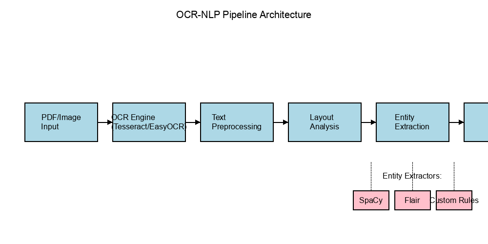

# OCR-NLP Pipeline: PDF + Entity Extraction to JSON

A production-grade pipeline for extracting structured information from unstructured documents using OCR and NLP techniques.

## Overview

This project implements an end-to-end document processing system that:

1. Takes scanned PDFs or images as input
2. Extracts text using advanced OCR techniques
3. Processes and cleans the extracted text
4. Identifies and extracts entities and key information
5. Outputs structured data in JSON format

The pipeline is designed to be modular, extensible, and suitable for processing various document types including forms, invoices, receipts, contracts, and more.

## Features

- **Multi-Engine OCR Support**: Integrates with both Tesseract and EasyOCR for optimal text extraction
- **Advanced Preprocessing**: Image enhancement and noise reduction for improved OCR accuracy
- **Robust Text Processing**: Cleaning, normalization, and layout analysis
- **Flexible Entity Extraction**: Support for multiple NER engines:
  - spaCy for general-purpose entity recognition
  - Flair for state-of-the-art sequence labeling
  - Transformers for deep learning-based extraction
  - Custom rule-based extractors for domain-specific entities
- **Configurable Pipeline**: Builder pattern for easy pipeline customization
- **Batch Processing**: Efficiently process multiple documents
- **Detailed Output**: Comprehensive JSON output with entities, metadata, and confidence scores

## Project Structure

```
ocr-nlp-pipeline/
├── data/
│   ├── pdf_samples/         # Sample PDFs for testing and demo
│   ├── sample_outputs/      # Pre-processed sample outputs
│   ├── raw/                 # Original scanned PDFs or images
│   └── processed/           # OCR-cleaned and structured text
├── diagrams/                # Architecture diagrams and visualizations
│   └── pipeline_architecture.png  # Visual representation of the pipeline
├── docs/                    # Auto-generated API documentation
├── notebooks/
│   └── 01_pipeline_walkthrough.ipynb  # Interactive pipeline tutorial
├── scripts/
│   ├── download_sample_pdfs.py    # Script to download sample PDFs
│   ├── generate_sample_outputs.py # Script to generate sample outputs
│   ├── generate_docs.py           # Script to generate API documentation
│   └── visualize_extraction.py    # Script to visualize extracted entities
├── src/
│   ├── ocr_engine.py       # Tesseract or EasyOCR integration
│   ├── nlp_parser.py       # NLP preprocessing logic
│   ├── entity_extractor.py # NER using spaCy, Flair, or transformers
│   └── pipeline.py         # End-to-end document processing orchestration
├── tests/                  # Unit and integration tests
│   ├── test_pipeline.py    # Tests for pipeline components
│   └── test_demo.py        # Tests for demo functionality
├── outputs/                # Final structured outputs (e.g., JSON files)
├── demo.py                 # Standalone demo script
├── run_pipeline.py         # CLI tool for running the pipeline
├── README.md               # This documentation
└── requirements.txt        # All Python dependencies
```

## Installation

1. Clone the repository:
   ```bash
   git clone https://github.com/yourusername/ocr-nlp-pipeline.git
   cd ocr-nlp-pipeline
   ```

2. Create and activate a virtual environment:
   ```bash
   python -m venv venv
   source venv/bin/activate  # On Windows: venv\Scripts\activate
   ```

3. Install dependencies:
   ```bash
   pip install -r requirements.txt
   ```

4. Install language models:
   ```bash
   python -m spacy download en_core_web_sm
   ```

5. Install Tesseract OCR (if not already installed):
   - **Ubuntu/Debian**: `sudo apt-get install tesseract-ocr`
   - **macOS**: `brew install tesseract`
   - **Windows**: Download installer from [GitHub](https://github.com/UB-Mannheim/tesseract/wiki)

## Quick Demo

The repository includes a standalone demo that showcases the pipeline's capabilities using pre-processed sample documents. This allows you to see the pipeline in action without requiring all dependencies to be installed.

### Setting up the Demo

1. Download sample PDFs:
   ```bash
   python scripts/download_sample_pdfs.py
   ```

2. Generate sample outputs:
   ```bash
   python scripts/generate_sample_outputs.py
   ```

3. Run the demo:
   ```bash
   python demo.py
   ```

   To run the demo for a specific sample:
   ```bash
   python demo.py invoice_1
   ```

### Terminal Output Example

When you run the demo, you'll see output similar to this:

```
OCR-NLP Pipeline Demo
=====================

Available sample documents:
1. invoice_1.pdf (Invoice)
2. invoice_2.pdf (Invoice)
3. form_uscis.pdf (Government Form)

Loading sample: invoice_1.pdf

Document Information:
- Filename: invoice_1.pdf
- Type: Invoice
- Pages: 1

OCR Text Sample:
--------------
INVOICE #1234
Date: 01/15/2023
Vendor: ABC Supplies Inc.
Customer: XYZ Corporation

Item         Quantity    Price      Total
Widget A     5           $10.00     $50.00
Widget B     3           $15.00     $45.00
...

Extracted Entities:
-----------------
INVOICE_NUM (1):
  - 1234 (confidence: 0.95)

DATE (1):
  - 01/15/2023 (confidence: 0.92)

ORG (2):
  - ABC Supplies Inc. (confidence: 0.89)
  - XYZ Corporation (confidence: 0.87)

MONEY (3):
  - $10.00 (confidence: 0.98)
  - $15.00 (confidence: 0.97)
  - $95.00 (confidence: 0.99)

Processing completed in 0.35 seconds
```

### Sample JSON Output

The pipeline generates structured JSON output like this:

```json
{
  "document": {
    "filename": "invoice_1.pdf",
    "type": "Invoice",
    "pages": 1,
    "processed_date": "2025-03-28T09:30:15"
  },
  "ocr": {
    "engine": "tesseract",
    "version": "4.1.1",
    "text": "INVOICE #1234\nDate: 01/15/2023\nVendor: ABC Supplies Inc.\nCustomer: XYZ Corporation\n\nItem         Quantity    Price      Total\nWidget A     5           $10.00     $50.00\nWidget B     3           $15.00     $45.00\n\nSubtotal: $95.00\nTax (10%): $9.50\nTotal: $104.50",
    "confidence": 0.92
  },
  "entities": [
    {
      "text": "1234",
      "type": "INVOICE_NUM",
      "confidence": 0.95,
      "position": {
        "page": 1,
        "bbox": [120, 50, 160, 65]
      }
    },
    {
      "text": "01/15/2023",
      "type": "DATE",
      "confidence": 0.92,
      "position": {
        "page": 1,
        "bbox": [50, 80, 120, 95]
      }
    },
    {
      "text": "ABC Supplies Inc.",
      "type": "ORG",
      "confidence": 0.89,
      "position": {
        "page": 1,
        "bbox": [70, 110, 180, 125]
      }
    },
    {
      "text": "$104.50",
      "type": "TOTAL",
      "confidence": 0.99,
      "position": {
        "page": 1,
        "bbox": [80, 350, 130, 365]
      }
    }
  ],
  "text_analysis": {
    "word_count": 48,
    "sentence_count": 5,
    "table_count": 1
  },
  "processing_time": 0.35
}
```

### Sample Data

The demo includes the following sample documents:

- **invoice_1.pdf**: A sample invoice with line items, amounts, and vendor information
- **invoice_2.pdf**: Another sample invoice with different structure
- **form_uscis.pdf**: A government form with fillable fields

### Demo Output

The demo will display the following information for each sample document:

- Document metadata (name, type, pages)
- OCR text sample
- Text analysis (word count, sentences, paragraphs)
- Layout analysis (tables, forms, headers, footers)
- Extracted entities grouped by type
- Processing times for each stage

## Usage

### Basic Usage

```python
from pathlib import Path
from src.pipeline import PipelineBuilder

# Create a pipeline with default configuration
pipeline = PipelineBuilder().build()

# Process a single document
result = pipeline.process_document(
    "data/pdf_samples/invoice_1.pdf",
    output_dir="outputs"
)

# Access extracted entities
for entity in result['entities']:
    print(f"{entity['text']} ({entity['type']})")
```

### Command-Line Interface

The pipeline can also be run from the command line:

```bash
# Process a single document
python run_pipeline.py data/pdf_samples/invoice_1.pdf outputs/

# Process all documents in a directory
python run_pipeline.py --batch data/pdf_samples/ outputs/

# Run the demo mode
python run_pipeline.py --demo

# Run the demo for a specific sample
python run_pipeline.py --demo invoice_1
```

### Custom Pipeline Configuration

```python
# Build a pipeline with custom configuration
pipeline = (
    PipelineBuilder()
    .with_ocr_engine('tesseract', lang='eng')
    .with_ocr_dpi(300)
    .with_language('en')
    .with_entity_extractor('spacy', model_name='en_core_web_sm')
    .with_entity_extractor('custom', patterns={
        'EMAIL': [r'\b[A-Za-z0-9._%+-]+@[A-Za-z0-9.-]+\.[A-Z|a-z]{2,}\b'],
        'URL': [r'https?://(?:[-\w.]|(?:%[\da-fA-F]{2}))+']
    })
    .build()
)

# Process a batch of documents
document_paths = [
    "data/pdf_samples/invoice_1.pdf",
    "data/pdf_samples/invoice_2.pdf",
    "data/pdf_samples/form_uscis.pdf"
]

results = pipeline.process_batch(
    document_paths,
    output_dir="outputs",
    preprocess_ocr=True,
    clean_text=True
)
```

## Documentation

### Architecture

The OCR-NLP Pipeline follows a modular architecture that allows for easy extension and customization:



The pipeline consists of the following main components:
- **OCR Engine**: Extracts text from PDF/image documents
- **Text Preprocessing**: Cleans and normalizes the extracted text
- **Layout Analysis**: Analyzes document structure and layout
- **Entity Extraction**: Identifies and extracts structured information
- **Output Generation**: Formats results into structured JSON

### API Documentation

The project includes comprehensive API documentation generated from docstrings using pdoc. To generate the documentation:

```bash
python scripts/generate_docs.py
```

This will create HTML documentation in the `docs` directory that you can view in your browser.

### Interactive Notebook

For a more interactive exploration of the pipeline, check out the Jupyter notebook:

```bash
jupyter notebook notebooks/01_pipeline_walkthrough.ipynb
```

This notebook provides a step-by-step walkthrough of the pipeline's functionality, from loading documents to analyzing extracted entities.

### Visualization

The project includes a script to visualize extracted entities on the original PDF:

```bash
python scripts/visualize_extraction.py data/pdf_samples/invoice_1.pdf data/sample_outputs/invoice_1_results.json
```

This creates a highlighted PDF showing the extracted entities and their positions in the document.

## Testing

The project includes unit tests to ensure reliability and correctness. To run the tests:

```bash
pytest tests/
```

The tests cover:
- Pipeline components and configuration
- Text preprocessing functionality
- Entity extraction accuracy
- Demo script functionality

## Example Output

```json
{
  "document": {
    "path": "data/pdf_samples/invoice_1.pdf",
    "name": "invoice_1.pdf",
    "type": "pdf",
    "size": 245678,
    "pages": 1
  },
  "ocr": {
    "text": "INVOICE\nInvoice Number: INV-2023-001\nDate: 2023-02-28\n\nBilled To:\nMaria Garcia\nGlobal Industries Ltd.\n123 Main St, New York, NY 10001\n...",
    "processing_time": 1.70
  },
  "text_analysis": {
    "word_count": 45,
    "sentences": 17,
    "paragraphs": 9,
    "layout": {
      "has_tables": true,
      "has_forms": false,
      "has_headers": true,
      "has_footers": true
    },
    "processing_time": 1.22
  },
  "entities": [
    {
      "text": "INV-2023-001",
      "type": "INVOICE_NUM",
      "source": "rule_based",
      "confidence": 0.88,
      "start_char": 1234,
      "end_char": 1245
    },
    {
      "text": "2023-02-28",
      "type": "DATE",
      "source": "spacy",
      "confidence": 0.96,
      "start_char": 1260,
      "end_char": 1270
    },
    {
      "text": "Maria Garcia",
      "type": "PERSON",
      "source": "spacy",
      "confidence": 0.86,
      "start_char": 1290,
      "end_char": 1302
    }
  ],
  "entity_extraction": {
    "count": 18,
    "processing_time": 1.07
  },
  "total_processing_time": 3.99
}
```

## Extending the Pipeline

### Adding Custom Entity Types

You can extend the pipeline to recognize custom entity types by adding a custom entity extractor:

```python
from src.entity_extractor import EntityExtractorFactory, RegexEntityExtractor

# Register a custom entity extractor
EntityExtractorFactory.register_extractor(
    'invoice_extractor',
    lambda **kwargs: RegexEntityExtractor(
        patterns={
            'INVOICE_NUM': [r'INV-\d{4}-\d{3}'],
            'TOTAL_AMOUNT': [r'Total:\s*\$[\d,]+\.\d{2}'],
            'TAX_ID': [r'Tax ID:\s*\d{2}-\d{7}']
        },
        **kwargs
    )
)

# Use the custom extractor in the pipeline
pipeline = (
    PipelineBuilder()
    .with_entity_extractor('invoice_extractor')
    .build()
)
```

### Implementing Custom Document Types

For specialized document types, you can create custom document processors:

```python
from src.pipeline import Pipeline

class InvoiceProcessor(Pipeline):
    def __init__(self, config=None):
        super().__init__(config)
        
    def process_document(self, document_path, **kwargs):
        # Get base processing result
        result = super().process_document(document_path, **kwargs)
        
        # Add invoice-specific processing
        invoice_data = self._extract_invoice_data(result)
        result['invoice_data'] = invoice_data
        
        return result
    
    def _extract_invoice_data(self, result):
        # Extract structured invoice data from entities
        invoice_data = {
            'invoice_number': None,
            'date': None,
            'vendor': None,
            'total': None,
            'line_items': []
        }
        
        # Fill in data from entities
        for entity in result['entities']:
            if entity['type'] == 'INVOICE_NUM':
                invoice_data['invoice_number'] = entity['text']
            elif entity['type'] == 'DATE':
                invoice_data['date'] = entity['text']
            # ... and so on
            
        return invoice_data
```

## Performance Considerations

- **OCR Quality**: The quality of the input document significantly affects OCR accuracy. For best results, use high-resolution scans (300+ DPI).
- **Memory Usage**: Processing large documents may require significant memory, especially when using transformer-based models.
- **GPU Acceleration**: For batch processing, consider using GPU-accelerated OCR and NLP models.
- **Preprocessing**: Enable image preprocessing for scanned documents to improve OCR accuracy.

## License

This project is licensed under the MIT License - see the LICENSE file for details.

## Acknowledgments

- [Tesseract OCR](https://github.com/tesseract-ocr/tesseract)
- [EasyOCR](https://github.com/JaidedAI/EasyOCR)
- [spaCy](https://spacy.io/)
- [Flair](https://github.com/flairNLP/flair)
- [Hugging Face Transformers](https://huggingface.co/transformers/)
